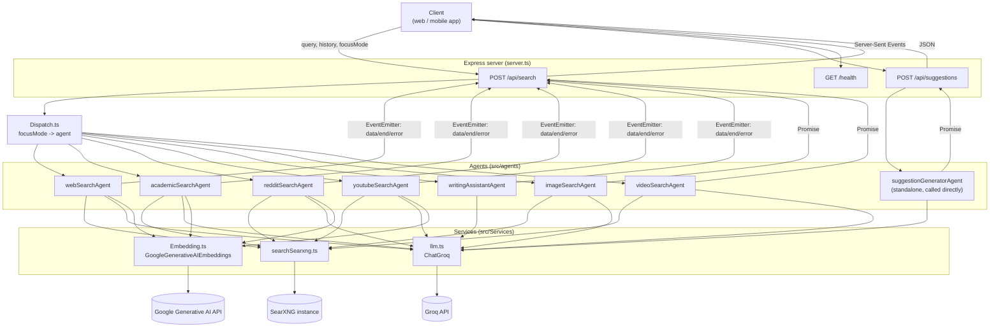
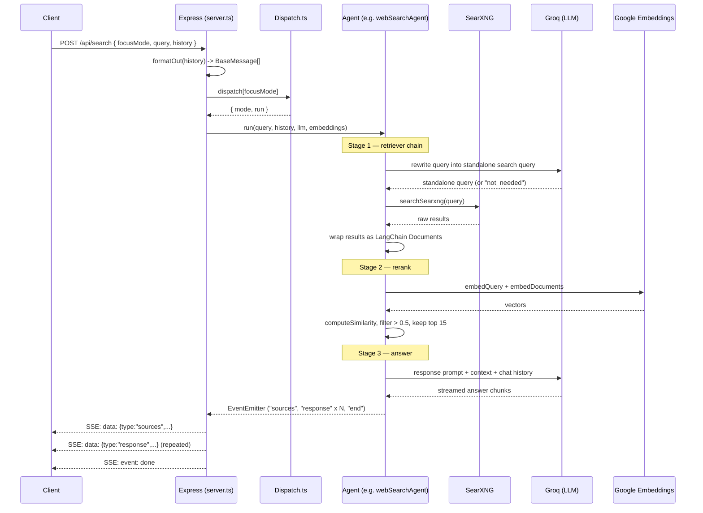

# Pivot Project — Backend

A Node.js/TypeScript backend that powers a multi-mode AI search assistant
(similar in spirit to Perplexity). A single `/api/search` endpoint dispatches
a query to one of several **agents** — web, academic, Reddit, YouTube, image,
video search, or a writing assistant — each built as a LangChain
`RunnableSequence` on top of Groq (LLM) and Google Generative AI (embeddings),
with SearXNG as the underlying search engine.

---

## Tech stack

| Layer            | Choice                                              |
|-------------------|------------------------------------------------------|
| Runtime            | Node.js (ESM, `"type": "module"`)                    |
| Language           | TypeScript                                           |
| HTTP server        | Express 5                                            |
| LLM orchestration  | LangChain (`@langchain/core`, `RunnableSequence`)     |
| LLM provider       | Groq (`@langchain/groq`, `llama-3.3-70b-versatile`)   |
| Embeddings         | Google Generative AI (`@langchain/google-genai`)      |
| Search backend     | SearXNG (self-hosted meta search engine, JSON API)   |
| Dev/run tooling    | `tsx` (run TypeScript directly, no build step needed) |

---

## Project structure

```
Pivot-Project-Backend-main/
├── server.ts                        # Express app, HTTP routes
├── src/
│   ├── Dispatch.ts                  # Maps focusMode -> { mode, run } for each agent
│   ├── Services/
│   │   ├── llm.ts                   # ChatGroq client
│   │   ├── Embedding.ts             # GoogleGenerativeAIEmbeddings client
│   │   └── searchSearxng.ts         # Thin HTTP client for a SearXNG instance
│   ├── agents/
│   │   ├── webSearchAgent.ts        # "stream" agent
│   │   ├── academicSearchAgent.ts   # "stream" agent
│   │   ├── redditSearchAgent.ts     # "stream" agent
│   │   ├── youtubeSearchAgent.ts    # "stream" agent
│   │   ├── writingAssistantAgent.ts # "stream" agent (no retrieval)
│   │   ├── imageSearchAgent.ts      # "list" agent
│   │   ├── videoSearchAgent.ts      # "list" agent
│   │   ├── suggestionGeneratorAgent.ts # standalone, not in Dispatch
│   │   └── Prompts/Prompts.ts       # all prompt templates, one export per agent
│   ├── utils/
│   │   ├── handleStream.ts          # turns LangChain streamEvents into an EventEmitter
│   │   ├── Chat_history.ts          # BaseMessage[] -> plain-text transcript
│   │   ├── FormatContext.ts         # retrieved docs -> numbered context block
│   │   ├── FormatOut.ts             # {role, content}[] -> BaseMessage[]
│   │   └── computeSimilarity.ts     # cosine similarity, used for reranking
│   ├── lib/outputParsers/
│   │   └── ListLineOutputParser.ts  # parses <tag>...</tag> LLM output into string[]
│   └── tests/
│       └── testAgents.ts            # test harness — 3 samples per agent
├── package.json
├── tsconfig.json
└── .env.example
```

---

## Architecture



Two response shapes come out of `Dispatch.ts`, and `server.ts` branches on
`agent.mode` to handle them differently:

- **`"stream"` agents** (webSearch, academicSearch, redditSearch,
  youtubeSearch, writingAssistant) return a Node `EventEmitter`. The server
  pipes its `data`/`end`/`error` events straight into a
  Server-Sent-Events (SSE) response.
- **`"list"` agents** (imageSearch, videoSearch) return a `Promise` that
  resolves to an array. The server just `await`s it and replies with plain
  JSON.

`suggestionGeneratorAgent` isn't in `Dispatch.ts` at all — it's wired to its
own route, `POST /api/suggestions`, and is always a plain `Promise<string[]>`.

---

## What each function does

### `server.ts`
- `GET /health` — liveness check.
- `POST /api/search` — reads `{ focusMode, query, history }`, looks up the
  matching agent in `dispatch`, formats `history` into LangChain
  `BaseMessage[]` via `formatOut`, then either streams SSE (`mode: "stream"`)
  or returns JSON (`mode: "list"`).
- `POST /api/suggestions` — reads `{ history }`, runs
  `handleSuggestionGenerator`, and returns follow-up question suggestions
  as JSON.

### `src/Dispatch.ts`
A plain object mapping a `focusMode` string (e.g. `"webSearch"`) to
`{ mode: "stream" | "list", run: handlerFn }`. This is the single source of
truth for which agents exist and how the server should talk to them.

### Retrieval-augmented agents — `webSearchAgent`, `academicSearchAgent`, `redditSearchAgent`, `youtubeSearchAgent`
All four follow the same two-stage LangChain pipeline:
1. **Retriever chain** — rewrites the user's follow-up question into a
   standalone search query (or returns `not_needed` for greetings/writing
   requests), calls `searchSearxng`, and wraps each hit in a LangChain
   `Document`.
2. **Reranking** — embeds the query and every retrieved document
   (`embeddings.embedQuery` / `embedDocuments`), scores each with
   `computeSimilarity` (cosine similarity), keeps hits scoring `> 0.5`, and
   takes the top 15.
3. **Answering chain** — feeds the reranked, numbered context plus chat
   history into the response prompt, streams the LLM's answer, and parses
   it with `StringOutputParser`.

`handleStream` (in `src/utils`) walks the chain's `streamEvents()` async
iterator and re-emits two things on a plain Node `EventEmitter`:
- `on_chain_end` of `FinalSourceRetriever` → `{ type: "sources", data }`
- `on_chain_stream` of `FinalResponseGenerator` → `{ type: "response", data }`
- `on_chain_end` of `FinalResponseGenerator` → `end`

### `writingAssistantAgent`
No retrieval step — it's a single prompt → LLM → stream chain for
rewriting/summarizing/expanding text the user supplies directly.

### `imageSearchAgent` / `videoSearchAgent`
Simpler, non-streaming pipeline: rewrite the query with the LLM →
`searchSearxng` with `categories: ["images"]` / video-specific engines →
map raw SearXNG hits into `{ img_src, url, title }` (video also keeps
`iframe_src`) → return up to 10 results as a plain array.

### `suggestionGeneratorAgent`
Takes only chat history (no query), asks the LLM to propose follow-up
questions, and parses the response with `ListLineOutputParser`, which reads
the content between `<suggestions>...</suggestions>` tags and splits it into
a `string[]`.

### `src/Services`
- `llm.ts` — one shared `ChatGroq` instance (`Groq_API_KEY`, model
  `llama-3.3-70b-versatile`), reused by every agent.
- `Embedding.ts` — one shared `GoogleGenerativeAIEmbeddings` instance
  (`GOOGLE_API_KEY`), used only by the retrieval agents for reranking.
- `searchSearxng.ts` — thin `fetch` wrapper around a SearXNG instance's
  `/search` JSON endpoint (`SEARXNG_API_URL`), used by every search agent.

### `src/utils`
- `handleStream.ts` — described above; the streaming glue between LangChain
  and Express SSE.
- `Chat_history.ts` — turns `BaseMessage[]` into a flat `"role: content"`
  transcript for prompts that just need history as text.
- `FormatContext.ts` — turns retrieved documents into the numbered
  `[1] Title / URL / content` block used inside answering prompts.
- `FormatOut.ts` — turns the client's raw `{ role, content }[]` history into
  LangChain `HumanMessage`/`AIMessage` objects.
- `computeSimilarity.ts` — cosine similarity between two embedding vectors,
  used to rerank retrieved documents.

---

## Data flow (single search request)



For `imageSearch` / `videoSearch`, steps collapse to: rewrite query → LLM →
`searchSearxng` → map results → return one JSON array (no reranking, no
streaming, no embeddings call).

For `suggestionGenerator`: client history → `formatOut` → prompt → LLM →
`ListLineOutputParser` → JSON array of suggestions.

---

## Setup

```bash
npm install
cp .env.example .env   # then fill in the values below
```

`.env`:
```
Groq_API_KEY=your_groq_key
GOOGLE_API_KEY=your_google_key
SEARXNG_API_URL=http://localhost:4000   # or wherever your SearXNG instance runs
```

## Running the server

```bash
npx tsx server.ts
```

`server.ts` is TypeScript and this project has no build step configured, so
run it with `npx tsx` (installed as a dev dependency) rather than `node`.
It starts Express on port `3000`.

## Running the agent tests

A standalone test harness at `src/tests/testAgents.ts` imports every agent
directly (no server needed) and drives each one with 3 sample inputs,
reporting pass/fail, timing, and an output preview per sample.

```bash
npx tsx src/tests/testAgents.ts                  # run every agent
npx tsx src/tests/testAgents.ts webSearch         # run just one
npx tsx src/tests/testAgents.ts webSearch imageSearch
```

Always invoke `.ts` files in this repo with `npx tsx <file>` — there's no
compiled `dist/` output to run with plain `node`.

## API reference

### `POST /api/search`
```json
{
  "focusMode": "webSearch",
  "query": "What are the latest developments in renewable energy storage?",
  "history": [
    { "role": "user", "content": "..." },
    { "role": "assistant", "content": "..." }
  ]
}
```
- `focusMode` — one of the keys in `Dispatch.ts`: `webSearch`,
  `academicSearch`, `redditSearch`, `youtubeSearch`, `writingAssistant`,
  `imageSearch`, `videoSearch`.
- Response is either an SSE stream (`stream` agents) or a single JSON body
  `{ success: true, data: [...] }` (`list` agents).

### `POST /api/suggestions`
```json
{ "history": [ { "role": "user", "content": "..." }, ... ] }
```
Returns `{ success: true, data: string[] }` — follow-up question
suggestions based on the conversation so far.

### `GET /health`
Returns `{ status: "ok", message: "backend is running!" }`.
